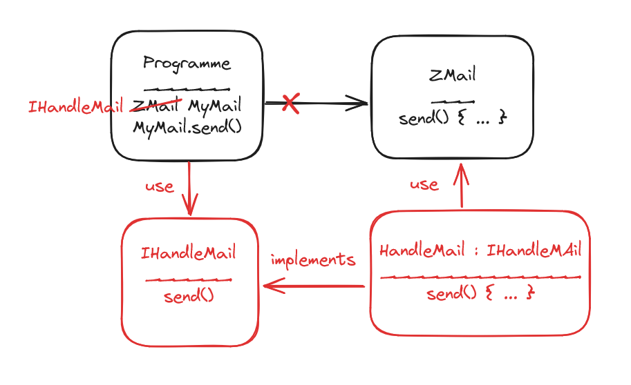

# Inversion  et Injection de Dépendances

L'[Inversion de Dépendance](https://fr.wikipedia.org/wiki/SOLID_(informatique)) et l'Injection de Dépendances sont des concepts fondamentaux en développement logiciel, utilisés pour améliorer la modularité et la maintenabilité des applications. Ils sont souvent utilisés conjointement pour permettre une meilleure gestion des dépendances au sein des applications en automatisant la création d'instantes de dépendances: l'application crée des instances quand elle en a besoin et pour la durée nécessaire (déterminée par le dev dans *Program.cs*).

> ###### Durée de vie des services
> 
> Dans le cas d'une application web, les Injections de Dépendances sont souvent utilisées pour les instances de services et peuvent avoir 3 durées de vie (pour des applications dotnet):
>
> ```csharp
> builder.Services.AddTransient<IMyService, MyService>();
> builder.Services.AddScoped<IMyService, MyService>();
> builder.Services.AddSingleton<IMyService, MyService>();
> // à chaque fois qu'une instance de IMyService est nécessaire,
> // l'application regarde si une instance existe dans le scope correspondant
> 
> public interface IMyService
> {
>     public int GetNum();
> }
> 
> public class MyService : IMyService
> {
> private int _number { get; }
> 
>     public MyService()
>     {
>         _number = new Random().Next(); //génère un int random entre intmin et intmax
>     }
> 
>     public int GetNum()
>     {
>         return _number;
>     }
> }
> ```
> 
> **Transient:** une instance du service est créée à chaque déclaration
> ```csharp
> app.MapGet("/test", (IMyService ms1, IMyService ms2) =>
> {
>    Console.WriteLine(ms1.GetNum() == ms2.GetNum()); // False
> });
> ```
> cas d'utilisation: service léger, stateless
> 
> **Scoped:** une instance du service est créée à chaque requête
> ```csharp
> app.MapGet("/test", (IMyService ms1, IMyService ms2) =>
> {
>    Console.WriteLine(ms1.GetNum() == ms2.GetNum()); // True
> });
> ```
> cas d'utilisation: on veut conserver l'état du service le temps de la requête 
> 
> **Singleton:** une seule instance du service est créée pour toute la durée de vie de l'application
> ```csharp
> app.MapGet("/test", (IMyService ms1) =>
> {
>    var ms = context.RequestServices.GetService<IMessageService>();
>    
>    GCHandle handle = GCHandle.Alloc(ms, GCHandleType.Pinned);
>    Console.WriteLine(handle.AddrOfPinnedObject());
>    handle.Free();
> });
> // les deux requêtes affichent la même adresse
> app.MapGet("/autretest", (HttpContext context) =>
> {
>    var ms = context.RequestServices.GetService<IMessageService>();
>    
>    GCHandle handle = GCHandle.Alloc(ms, GCHandleType.Pinned);
>    Console.WriteLine(handle.AddrOfPinnedObject());
>    handle.Free();
> });
> // ce code permet de voir comment accéder à l'adresse d'un objet mais afficher les _number
> // de chaque service est une meilleure pratique et plus safe
> ```
> cas d'utilisation: état du service ne sera pas modifié par d'autres sources
> 
> ### KeyedServices
>
> Il est également possible d'instancier différentes implémentations d'une interface en fonction d'un mot-clé.
> ```csharp
> builder.Services.AddTransient<IMyService, MyServiceOne>("first");
> builder.Services.AddTransient<IMyService, MyServiceTwo>("second");
>
> app.MapGet("/keyedservice", (
>	[FromKeyedServices("first")] IMyService nameOne,
>	[FromKeyedServices("second")] IMyService nameTwo,
> ) => { ... });
> ```
> **[FromKeyedServices]** est un attribut permettant d'indiquer au container quel implémentation de l'interface instancier en fonction de la *key* qui lui est fournie.

## Inversion de Dépendance

L'Inversion de dépendance est un principe de conception dans lequel, au lieu d'une class dépendant d'une implémentation, la classe et l'implémentation dépendent d'abstractions (interfaces). Forçant les deux partis à respecter un contrat.

### Principes clés

- **Dépendance à l'interface:** Les composants dépendent d'abstractions (interfaces) plutôt que d'implémentations concrètes. Cela favorise la flexibilité du code.
- **Modularité accrue:** L'Inversion de dépendance favorise la modularité en séparant les préoccupations et en réduisant les couplages entre les différents composants. Seule une modification du contrat impliquera une modification du code du programme.


> Au lieu de dépendre directement de *ZMail* qui est une librairie externe qu'on ne maîtrise pas et qui pourrait être modifiée à tout moment, on dépend d'une interface *IHandleMail* qui met en place un contrat.
> On crée également une classe *HandleMail* qui implémente notre interface en utilisant les outils de *ZMail*.
> De cette façon, si si nous devions nous séparer de *ZMail*, on devrait uniquement ajuster le code de *HandleMail* mais le code de notre classe *Programme* serait en sécurité.

## Injection de Dépendances


L'Injection de Dépendances est une technique utilisée pour fournir les dépendances nécessaires à un composant à partir d'un container de service plutôt que de les instancier directement à l'intérieur du composant. Cela permet de découpler le service et le composant. *(voir services.AddXX plus haut)*

### Types d'Injection de Dépendances

- **Injection de Dépendances par Interface:** Les dépendances sont fournies via une interface, permettant un découplage plus fort entre les composants. (comme plus haut)
- **Injection de Dépendances par Constructeur:** Les dépendances sont fournies au composant via son constructeur.

```csharp
// sans injection
public class MyService
{
	private MyDep _dependancy;

	public MyService()
	{
		_dependancy = new MyDep();
	}
}

// avec l'injection, le constructeur devient

public MyService(MyDep dependancy)
{
	// le container voit qu'il a besoin d'une instance de MyDep
	// et la crée ou non selon le scope défini avant de l'injecter ici
	_dependancy = dependancy
}

// en ajoutant l'utilisation des Primary Constructor, le code devient

public class MyService(MyDep _dependancy) { }
```
> [Primary Constructor](https://www.youtube.com/watch?v=Slvyugn458Q)

## Avantages

- **Découplage des composants:** L'Inversion et l'Injection de Dépendances permettent de réduire les couplages entre les composants, favorisant ainsi la modularité et la maintenabilité du code.
- **Réutilisabilité:** Les composants deviennent plus facilement réutilisables car ils dépendent d'abstractions plutôt que d'implémentations concrètes. ***ARCHITECTURE PLUGABLE/HEXAGONALE***
- **Inversion du contrôle:** La création et la gestion des dépendances est remise au conteneur.

## Limitations

- **Complexité accrue:** La mise en œuvre de l'Inversion et de l'Injection de Dépendances peut ajouter une certaine complexité d'abstraction, surtout pour les applications de petite taille.
- **Surcharge cognitive:** Comprendre et maintenir du code utilisant ces principes peut nécessiter une courbe d'apprentissage pour les développeurs.
